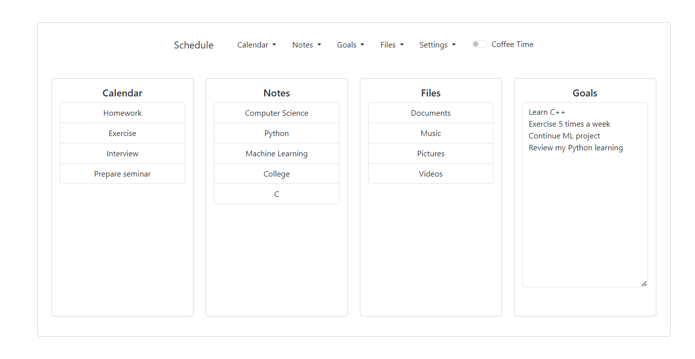

# Schedule
#### Video Demo:  https://www.youtube.com/watch?v=sKFxsNmc_sM
#### Description:

\
Schedule is a simple routine organizer. It can handle with daily tasks, notes, goals and files. Everything is registered at a SQL database, and can be recovered later. It's also possible to use multiple users.\
Once the server is active, Schedule can be accessed from anywhere, whether by a smartphone, a tablet or a desktop.\
If necessary, every data can be modified. For example, tasks can be rescheduled, notes can be increased, and files are removable. When a file is uploaded, it is automatically moved to its specific folder, such as Documents or Videos. And, they can be downloaded or opened later.\
Goals are synchronized every time a word is typed, so don't mind losing your work!\
Another cool feature is 'Coffee Time'. This is a simple form to take a break, and since it's enabled, editing is blocked.\
In order to run this project, install its requirements, listed in "requirements.txt". Then, to test it, try 'flask run' on a terminal. Some data about how this project works can be found in documentation, such as its database and user structure.\
This project was made using Bootstrap, Flask, JavaScript, HTML, CSS, Python and SQL (SQLite3).

Below is a brief explanation of what which file does:

app.py - It is responsable to control every aspect of the program, such as login, insert data in the database, etc.\
helpers.py - helpers is imported by app.py, and it has two functionalities. Verify login (if a user is not logedin, then they're redirected), and to return an error message, as requested by app.py, called "Mission Stopped".
schedule.db - It contains almost all information requested by the program, which means that users, tasks, notes, goals and settings are here.\
templates - As its name suggests, every template used by Jinja is here. For example, bar.html, which is used to compose Schedule functionality bar.\
Another important file is home.html, because it's where the functionalities mentioned below are properly written (add task, remove, modify note, etc.).\
Note that some of them are similar, but have different uses, i.e. "actions", like register and modify.\
static - This folder has some modifiers relatonied to templates. They're listed below:

js - Schedule has a lot of JavaScript code in it. They are used not only to change something in the page, but rather, they get and post data too.
This is usually done with AJAX, which means that no page reload is necessary to manipulate information, resulting in a smoothly experience.

For example, home.js, which is the most complex one, is used to get all lists required by the home page, namely, tasks of the day, notes, folders and goals.

calendar.js - It is mainly used to get its items. For example, it lists every task when choosing to remove one.\
coffee.js - Loads and unload 'Coffee time' message.\
files.js - Lists all files and folders, even if the user create a custom folder (which is not allowed by the software explictly).\
jQuery.js - This is a third party library, developed by OpenJS Foundation, which is used by some parts of the software.\
login.js - Is a simple file, that insert error messages when some login information, such as email or password is invalid.\
notes.js - Loads notes, including their name, data and text. When modifying, it creates the text camp and insert the text of that note registered in schedule.db.\
register.js - Validate user data when creating an account.
theme.js - Switch between white/dark mode based on user preference.

css - This folder contains some simple css files to change little thing on page behaviour.\
There is calendar.js, which is responsable for allowing scroll when a task description is too long. Files.css, home.css and main.css are there too.

documentation - It is not used by the program directly. But, it has some important information.\
database - Is the Schedule database tree.\
srs - Stands for Software Requirements Specification. It was what I had in mind when decided to develop this project.\
user_folder - Every default user folder is listed here. Note that their username is not used directly, but user_id is used instead, in order to increase privacy.
